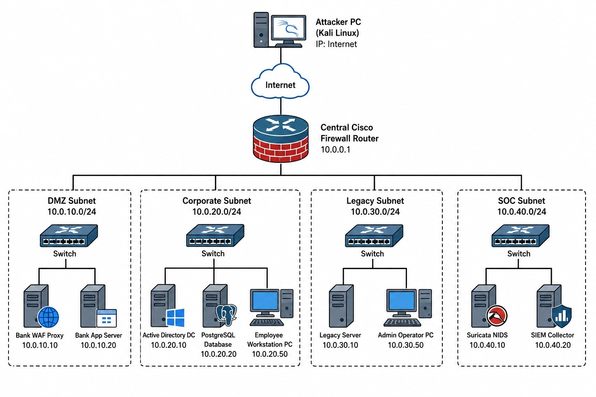

<div align="center">



# 🏦 LiteTrainingGround (LTG)

### Сегментированный киберполигон в формате банковской инфраструктуры


</div>

---

## ⚠️ Проект в активной разработке

Репозиторий наполняется поэтапно: сначала архитектура и firewall-конфиги, затем уязвимые сервисы по сегментам, в конце — SOC-контур и сценарии атак с writeup'ами.
Звезду/фолловер можно поставить сейчас, чтобы не пропустить релиз — но разворачивать пока рано, живой лабы ещё нет.

**Прогресс:**

- [x] Архитектура сети и модель угроз
- [x] Схема сегментации (DMZ / Corporate / Legacy / SOC)
- [ ] Конфигурация firewall (nftables)
- [ ] DMZ: WAF + уязвимое банковское приложение
- [ ] Corporate: AD DC, AD CS, рабочая станция
- [ ] Legacy: сервер 2008 R2 с EternalBlue
- [ ] SOC: Suricata + Wazuh/ELK
- [ ] Скрипты автодеплоя (Vagrant/Packer)
- [ ] Сценарии атак с пошаговым прохождением
- [ ] Detection coverage matrix (MITRE ATT&CK)

---

## 🎯 Идея проекта

**LiteTrainingGround** — это не набор изолированных CTF-заданий, а связная инфраструктура, где каждая уязвимость является шагом единой цепочки атаки: от точки входа в DMZ до получения прав Domain Admin, с параллельным разбором того, что из этого детектит SOC.

```
Internet → WAF → Bank App Server → DMZ pivot
                                        │
                                        ▼
                         Corporate (AD DS, AD CS, workstations)
                                        │
                                        ▼
                              Legacy (устаревшие хосты)

Всё происходящее — Suricata NIDS + SIEM в изолированном SOC-сегменте
```

## 🗺️ Архитектура

<!-- Скриншот схемы сети: положи файл как img/architecture.png -->
<!--  -->

| Сегмент | Подсеть | Назначение |
|---|---|---|
| DMZ | `10.0.10.0/24` | WAF-прокси, банковское веб-приложение |
| Corporate | `10.0.20.0/24` | Active Directory, БД, рабочие станции |
| Legacy | `10.0.30.0/24` | Устаревшие серверы и хосты |
| SOC | `10.0.40.0/24` | Suricata NIDS, SIEM, мониторинг |

Полная архитектура и модель угроз — в [`docs/architecture.md`](docs/architecture.md) *(скоро)*.

## 🛠️ Стек

`nftables` · `Suricata` · `Wazuh/ELK` · `HAProxy + ModSecurity` · `Active Directory` · `Vagrant`

## 📌 Планы

Актуальный статус и ближайшие шаги — во вкладке [Projects](../../projects) репозитория.

## 🔗 Ссылки

- 👤 Автор: [**Mavrhide**](https://github.com/Mavrhide)
- 💬 Telegram: [t.me/mavrhide](https://t.me/mavrhide)
- 🏆 HackTheBox: [профиль](https://profile.hackthebox.com/profile/019df95b-5a96-71ec-aa89-5a83d3e2b07c)
- 🏆 TryHackMe: [профиль](https://tryhackme.com/p/mavrhide)
- 📜 Сертификаты: [PT EdTechLab — SIEM](https://github.com/Mavrhide/Certificates/blob/main/PT-EdTechLab-SIEM.pdf) · [PT EdTechLab — NTA](https://github.com/Mavrhide/Certificates/blob/main/PT-EdTechLab-NTA.pdf)

---

<div align="center">

Автор: [**Mavrhide**](https://github.com/Mavrhide) · [Telegram](https://t.me/mavrhide)

</div>
