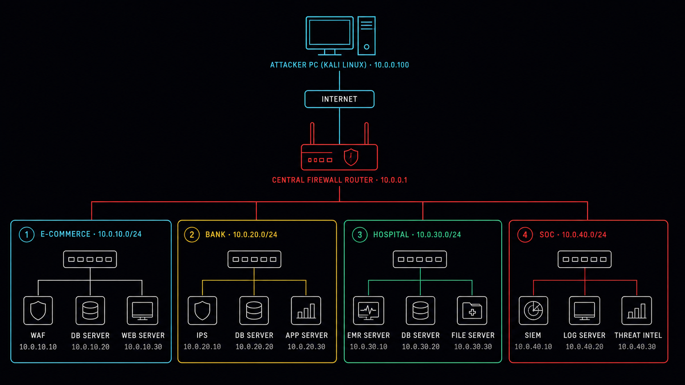

<div align="center">



# 🎯 LiteTrainingGround (LTG)

### Сегментированный киберполигон с тремя бизнес-доменами и SOC-контуром


</div>

---

## ⚠️ Проект в активной разработке

Репозиторий наполняется поэтапно: сначала архитектура и firewall-конфиги, затем уязвимые сервисы по сегментам, в конце — SOC-контур и сценарии атак с writeup'ами.
Звезду/фолловер можно поставить сейчас, чтобы не пропустить релиз — но разворачивать пока рано, живой лабы ещё нет.

**Прогресс:**

- [x] Архитектура сети и модель угроз
- [x] Схема сегментации (E-commerce / Bank / Hospital / SOC)
- [x] Конфигурация firewall (nftables)
- [x] E-commerce: WAF + уязвимый интернет-магазин техники
- [x] Bank: AD DC, core-banking БД, рабочая станция оператора
- [x] Hospital: EHR/PACS-сервер, legacy-хост с медицинским ПО
- [ ] SOC: Suricata + Wazuh/ELK
- [ ] Скрипты автодеплоя (Vagrant/Packer)
- [ ] Сценарии атак с пошаговым прохождением
- [ ] Detection coverage matrix (MITRE ATT&CK)

---

## 🎯 Идея проекта

**LiteTrainingGround** — это не набор изолированных CTF-заданий, а связная инфраструктура из трёх разных бизнес-доменов (e-commerce, банк, медицина), где каждая уязвимость — шаг единой цепочки атаки: от точки входа в интернет-магазине до получения прав Domain Admin в корпоративной сети и доступа к данным пациентов/клиентов, с параллельным разбором того, что из этого детектит SOC.

Три домена нужны, чтобы отработать разные модели угроз и разные классы защищаемых данных на одной инфраструктуре:

| Домен | Что защищает | Типичные риски для отработки |
|---|---|---|
| 🛒 E-commerce | Данные карт, заказы | SQLi, IDOR, уязвимости WAF-обхода |
| 🏦 Bank | Финансовые операции, PCI DSS | AD-атаки, повышение привилегий, боковое движение |
| 🏥 Hospital | ПДн пациентов, мед. системы | Legacy-хосты, устаревшие протоколы, EternalBlue-класс |
| 🛰 SOC | Мониторинг всего периметра | Detection engineering, разбор алертов |

```
Internet → WAF → Онлайн-магазин техники (точка входа)
                            │
                            ▼
              Общая корпоративная сеть (AD DS, AD CS)
                    │                       │
                    ▼                       ▼
             Bank-сегмент             Hospital-сегмент
        (core-banking БД,          (EHR/PACS, legacy-хосты
         рабочие станции)           с устаревшим ПО)

Всё происходящее — Suricata NIDS + SIEM в изолированном SOC-сегменте
```

## 🗺️ Архитектура

<!-- Скриншот схемы сети: положи файл как img/architecture.png -->
<!--  -->

| Сегмент | Подсеть | Назначение |
|---|---|---|
| E-commerce (DMZ) | `10.0.10.0/24` | WAF-прокси, веб-приложение интернет-магазина техники |
| Bank | `10.0.20.0/24` | AD DС, core-banking БД, рабочая станция оператора |
| Hospital | `10.0.30.0/24` | EHR/PACS-сервер, legacy-хост, рабочая станция мед. персонала |
| SOC | `10.0.40.0/24` | Suricata NIDS, SIEM, мониторинг |

Полная архитектура и модель угроз — в [`docs/architecture.md`](docs/architecture.md) *(скоро)*.

## 🛠️ Стек

`nftables` · `Suricata` · `Wazuh/ELK` · `HAProxy + ModSecurity` · `Active Directory` · `PostgreSQL` · `Vagrant`

## 📌 Планы

Актуальный статус и ближайшие шаги — во вкладке [Projects](../../projects) репозитория.

## 🔗 Ссылки

- 👤 Автор: [**Mavrhide**](https://github.com/Mavrhide)
- 💬 Telegram: [t.me/mavrhide](https://t.me/mavrhide)
- 🏆 HackTheBox: [профиль](https://profile.hackthebox.com/profile/019df95b-5a96-71ec-aa89-5a83d3e2b07c)
- 🏆 TryHackMe: [профиль](https://tryhackme.com/p/mavrhide)
- 📜 Сертификаты: [PT EdTechLab — SIEM](https://github.com/Mavrhide/Certificates/blob/main/PT-EdTechLab-SIEM.pdf) · [PT EdTechLab — NTA](https://github.com/Mavrhide/Certificates/blob/main/PT-EdTechLab-NTA.pdf)

---

<div align="center">

Автор: [**Mavrhide**](https://github.com/Mavrhide) · [Telegram](https://t.me/mavrhide)

</div>
